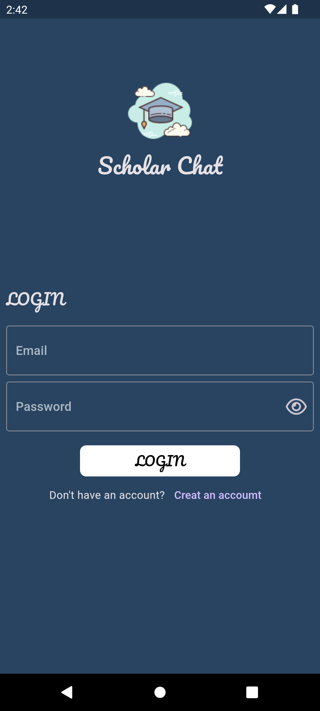
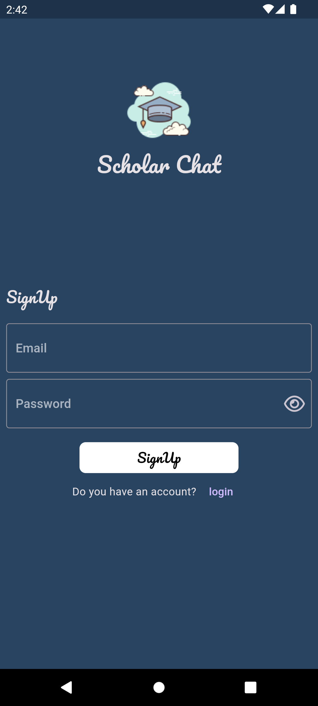
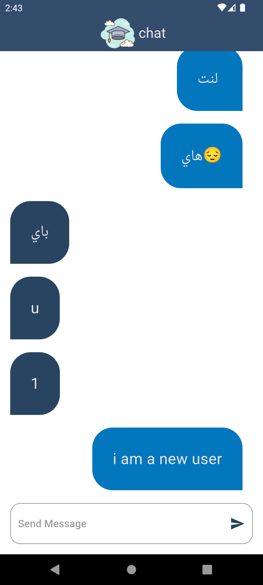

<<<<<<< HEAD

# Chat Application

Real-time chat messaging provided by us allows users to chat with each other.

## Installation

* Download APK
* Install the application

## Screenshots

## Tech Stack

**UI:** Flutter

**FireBase:** Authentication 

## Features

- Live previews
- Fullscreen mode
- Cross platform

## License

[MIT](https://choosealicense.com/licenses/mit/)

=======
chat_app

A simple chatting app.
>>>>>>> 7084fb0dab5f71f3f3af097de1a7761f8602e417
